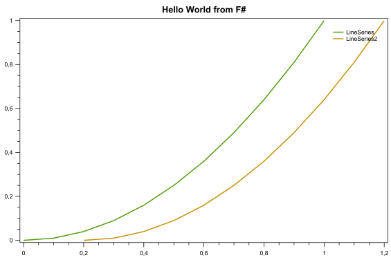

# Foxy [![Status Umbra][status-umbra]][andivionian-status-classifier]

Experimental F# eDSL for OxyPlot charting library

Inspired by [Elmish.XamarinForms][elmish-xamarin-forms]

## Example

```fsharp
Foxy.PlotModel(
    title = "Hello World from F#",
    axes = [
        Foxy.LinearAxis(position = AxisPosition.Bottom)
        Foxy.LinearAxis(position = AxisPosition.Left)
    ],
    series = [
        Foxy.LineSeries(title = "LineSeries",
            points = [for x in 0.0 .. 0.1 .. 1.0 -> (x, x*x)])
        Foxy.LineSeries(title = "LineSeries2",
            points = [for x in 0.0 .. 0.1 .. 1.0 -> (x + 0.2, x*x)])
    ])
```



## Build

[.NET Core SDK][net-core-sdk] is required to build the project.

```
$ dotnet build .\Foxy.Core\Foxy.Core.fsproj
```

[andivionian-status-classifier]: https://github.com/ForNeVeR/andivionian-status-classifier#status-umbra-
[status-umbra]: https://img.shields.io/badge/status-umbra-red.svg

[elmish-xamarin-forms]: https://github.com/fsprojects/Elmish.XamarinForms
[net-core-sdk]: https://www.microsoft.com/net/download/core#/sdk